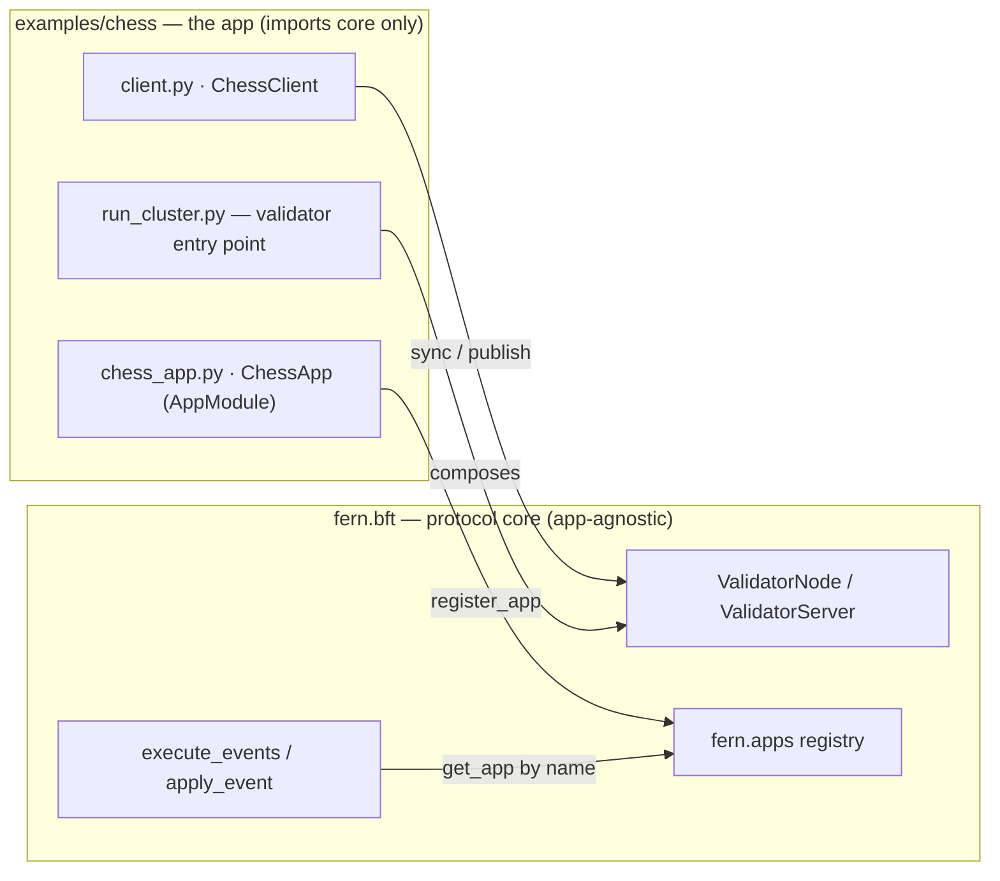
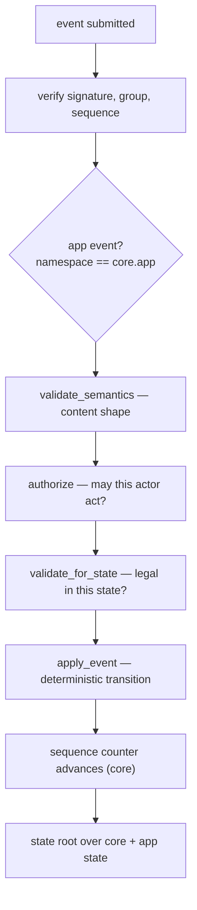
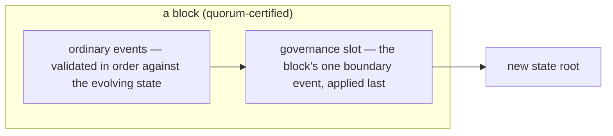

# Chess on FERN — design notes

A worked example of building an application on the FERN protocol core **without
modifying it**. This document explains how the chess app works and *why* it's
designed the way it is: the app-module model, the boundary-event mechanism, and
why the pre-finalization window is not exploitable. For how to run and play it,
see [README.md](README.md).

---

## 1. What this example demonstrates

FERN is split into two layers with a hard dependency boundary:

- **The protocol core** (`fern.bft`) owns universal facts (membership, sequences,
  the validator set, identity) and the consensus-critical machinery. It has no
  application policy and no application state.
- **App modules** own all policy and application state, and are plugged in by
  name through a registry.

Chess is the second app on the core (after chat). It was chosen because it
exercises the abstraction in ways a message feed doesn't:

- real, meaningful state (a board) that changes deterministically;
- strict turn-based authorization, not just membership;
- a boundary event (`new_game`) that redefines who may act;
- the app reacting to core membership events (`leave` → forfeit).

If a game with rules, turns, and state can run on the core with zero chess code
in `src/fern`, the boundary holds for other kinds of apps too.

## 2. Architecture: a module, not a standalone validator



The dependency points one way — app → core. Nothing in `src/fern` imports this
directory. The registry (`fern.apps`) is the seam: a group commits an `app` name
in its genesis, and the core looks the module up by name (`get_app`) and
delegates to it. (The app also *reads* core state — membership, sequences — when
it validates events, and never writes it; that data flow is in §3.) Registering
the module is a one-liner:

```python
from fern.apps import register_app
from chess_app import CHESS_APP

register_app(CHESS_APP)   # this process can now host / verify app="chess" groups
```

Two consequences worth being precise about:

- **The validators running chess are the real core validators.** `cluster.py`
  constructs `ValidatorNode` / `ValidatorServer` from `fern.bft` — the actual
  consensus code, unchanged. `run_cluster.py` is a *chess validator entry
  point*: it registers the module and runs the core machinery, the way a chain
  binary wires a module into the SDK. Nothing is reimplemented.
- **The core never imports app code.** A process that hasn't registered chess
  rejects a chess group with `AppNotSupportedError`. Registration is the
  plugin mechanism — and it's the only thing needed to add an app.

## 3. The app module contract

An `AppModule` is the whole interface the core holds against an app:

| method | role |
|---|---|
| `name`, `boundary_types` | identity and which events are boundary (see §7) |
| `initial_state(genesis)` / `state_from_dict` | build / deserialize app state |
| `validate_genesis(content)` | reject bad genesis content for this app |
| `validate_semantics(event)` | context-free shape of an event's content |
| `authorize(core, app, event, time) → bool` | **policy**: may this actor do this at all? |
| `validate_for_state(core, app, event, time)` | **legality**: is this action legal *in this state*? |
| `apply_event(core, app, event, time) → app state` | deterministic state transition |

The event pipeline the core runs for every app event:



The `authorize` / `validate_for_state` split is deliberate. `authorize` is the
coarse policy gate (returned as a boolean, so the core can reuse it for
*delegated core events* too — ban, kick, `validator_update`; see §9–§10).
`validate_for_state` is the fine-grained legality check. Both receive the whole
event, the core state, the app state, and the certified time, which is what
makes context-dependent governance possible (see §10).

## 4. State

`ChessState` is a frozen dataclass:

| field | meaning |
|---|---|
| `white`, `black` | player pubkeys (`""` before a game) |
| `board` | `{square → piece code}`, e.g. `{"e2": "wP", "e8": "bK"}` |
| `turn` | `"w"` or `"b"` |
| `status` | `"waiting" \| "active" \| "over"` |
| `winner` | player pubkey, `"draw"`, or `""` |
| `moves` | plies played in the current/last game |

Serialization matters. The state root is a single SHA-256 over the canonical
combined dict — core fields and app fields merged:

```python
# GroupState.to_dict() in the core
combined = self.core.to_dict()
combined.update(self.app.to_dict())   # chess_* keys, e.g. chess_board
root = canonical_hash(["fern-bft-state", combined])
```

The `chess_` prefix on every key keeps app fields from colliding with core
fields, and determinism requirements apply to the app exactly as to the core:
`to_dict` sorts keys, `apply_event` returns a new frozen state rather than
mutating, and any two validators applying the same events must derive the same
board. This is what lets clients verify chess state exactly as they verify chat
state — one root, no special cases.

## 5. Events

| event | content | class | effect |
|---|---|---|---|
| `chess.new_game` | `{white, black}` | **boundary** | defines the players, resets the board, white to move |
| `chess.move` | `{from, to}` | ordinary | applies a legal move, flips turn |
| `chess.resign` | `{}` | ordinary | ends the game, other player wins |

Event types must be **namespaced with the app name** (`chess.*`); the core
rejects any app event whose namespace isn't the group's app. Chess reuses the
core's shared field helpers for semantic validation (pubkeys, square notation),
so validation style is consistent across apps.

## 6. Authorization model

The rules, in one place:

- **Eligibility** (`authorize`): the signer must be a joined, non-banned member.
- **`new_game`**: the signer must be one of the two nominated players; both
  players must be eligible members; `white != black`; no game may already be
  active.
- **`move`**: the signer must be a player in the active game, it must be their
  turn, and the move must be legal for the piece on the current board
  (`is_legal_move`: movement rules, path blocking, no self-capture).
- **`resign`**: the signer must be a player in the active game.

Authorization is enforced at every layer by the same deterministic code: at
ingress (admission), by the proposer (block building), and by the quorum (block
verification). There is exactly one implementation of the rules, and it lives
in the app.

## 7. Boundary events: why `new_game` is one, and moves aren't

A **boundary event** is one that changes the *validity domain* — who may act,
what may be referenced, or who validates:

- core: `ban` / `kick` / `invite` / `unban` (membership), `validator_update` (validators);
- chat: `manager_add` / `mod_add` (roles), `channel_create` / `channel_delete` (references);
- chess: `new_game` (the players are *defined* — a new actor set and a reset board).

The core enforces two structural rules on them: **at most one per block**, and
**applied last** (in the governance slot):



This guarantees every ordinary event in a block is judged against **one stable
domain** — the block can't interleave a domain change with the events it
changes. Boundary events also skip the batching window at ingress so they commit
promptly, because everything else depends on them.

A **move changes none of the domain**: the two players are already authorized to
act (`authorize` only checks membership in `{white, black}`), and the turn flip
merely picks *which of the already-authorized* actors may act next. The turn is
a state attribute, enforced per-event against current state — the same category
as a chat message, which references a channel rather than redefining who may
post. That's why moves are ordinary events, not boundary ones.

`resign` is the borderline case: it *ends* the domain (nobody may move after).
It's ordinary here because the drop-on-failure mechanism in §8 keeps that safe;
marking it boundary would be a valid, stricter choice that guarantees a resign
block can contain no moves at all. It's a policy knob, not a correctness
requirement.

## 8. Admission, finalization, and why it isn't exploitable

First, a reframe: **ingress is not action.** Submitting an event only admits it
to a pending pool (the mempool) with an ingress receipt. State changes only when
the event commits in a quorum-certified block. Admission validates the event
against the **finalized** state plus a per-author sequence check.

Now the subtle case that motivates your question. Say white submits `e2e4` and
then, immediately, `g1f3` — before `e2e4` commits. Both pass admission: `g1f3`
is perfectly legal against the *starting* board. But once `e2e4` commits, it's
black's turn, so `g1f3` is "not your turn" — invalid.

What actually happens, in the proposer's `_select_pending_events`:

```python
for event in ordinary:
    ...
    try:
        state = apply_event(state, event, ...)   # re-validated in BLOCK ORDER
    except ApplicationError:
        self.store.remove_pending(event.id or "")  # dropped from the mempool
        continue                                    # keep building the block
```

The proposer re-executes pending events **in block order against the evolving
state**, and any event that fails is dropped and skipped. The quorum
independently re-executes the proposed block and rejects it if execution fails —
so an invalid event can never be certified. Consequences:

- **No safety impact** — invalid events can't commit; the chain can't fork.
- **No chain stall** — the proposer skips failures and still produces a block.
- **No cross-author harm** — a dropped event from white doesn't block bob's
  valid moves from being selected.
- **Bounded** — per-author sequences are enforced at admission, the submit path
  is rate-limited, and blocks are capped by event count and byte size.

The entire "attack" a malicious player can mount is getting their *own* junk
events silently discarded. That's the whole exploit surface.

This is a deliberate trade-off: admission is cheap (finalized-state plus
sequence checks), and the authoritative gate is **block-order execution** — the
standard light-client admission pattern. It also explains an observed property
of turn-based apps: moves must serialize across blocks, because each move is
admitted against the state in which the *previous* move is already committed.
That serialization is a consequence of the game's rules, not something the core
imposes.

## 9. Reacting to core events: `leave` → forfeit

The app's `apply_event` receives core events too, so it can attach side effects
to membership transitions — the same pattern chat uses to drop a banned user's
roles. In chess, a player who `leave`s an active game forfeits it:

```python
if event_type == ProtocolTypes.LEAVE and app.status == "active":
    if event.author in {app.white, app.black}:
        winner = app.white if event.author == app.black else app.black
        return replace(app, status="over", winner=winner)
```

Why `leave` and not ban/kick: chess authorizes **no one** to ban or kick
(`authorize` returns `False` for those core events), so a forfeit-on-ban path
would be unreachable dead code. `leave` is a self-service core event — any
member may send it — so the side effect is genuinely reachable and demonstrates
the pattern cleanly.

## 10. Validator management: shared machinery, app-owned policy

Validator-set changes are **not rebuilt per app**. The entire mechanism is core:
`validator_update` is a core boundary event, and `_validate_validator_update`
checks the new validators' `SyncReady` certificates (each signed by the new
validator, matching the exact checkpoint), bumps the epoch, and builds the next
validator set. Every app inherits this — including the readiness handshake and
the checkpoint verification.

The only per-app piece is **who may send `validator_update`**, decided by the
app's `authorize`:

- **chat**: `authorize` returns `True` for managers → managers change validators.
- **chess**: `authorize` returns `False` for `validator_update` → **the chess
  validator set is currently immutable**. That's a legitimate policy choice (a
  static club), not a limitation of the mechanism.

Because `authorize` receives the whole core state *and* the app state, an app
could build richer governance in its own state — a vote ledger, a council list,
time-locked proposals — and grant `validator_update` only when that state says
a vote passed. The core then executes whatever the app approves, with all its
safety checks intact. Governance is policy; the machinery is infrastructure.

## 11. The client and the trust model

`client.py` is intentionally thin. `ChessClient.sync()` uses the core's
`sync_from_validators` (fetch commits, verify signatures, quorum, and the state
root), and `_publish` uses `publish_to_validators` (submit to all validators,
verify ingress receipts against the propagation threshold). The client registers
the chess module so it can decode the app layer of the state root.

Two design points:

- **Dependent events wait for finalization.** Joins precede `new_game`, and each
  move precedes the next — the CLI's `wait_for` polls the finalized state until
  the event commits. This is what honest clients do (see §8 for what happens to
  dishonest ones).
- **The client verifies rather than trusts.** It re-derives the state and checks
  the quorum's signatures instead of believing a validator's summary — the same
  verifying-light-client model as Bracken. The validators provide availability;
  the quorum assumption (2f+1 honest) provides safety; no single validator
  controls what's true.

## 12. Design decisions at a glance

| decision | why |
|---|---|
| Second app is a game, not another feed | exercises state, turns, boundary events, and core-event side effects — the full contract |
| App lives in `examples/`, not `src/fern` | proves the core hosts apps it knows nothing about |
| Registry lookup by name, not import | keeps the dependency one-way; registration is the plugin mechanism |
| One app per group, `chess.*` namespace | the core's namespace check (`namespace_of == app`) is the hard boundary |
| `authorize` separate from `validate_for_state` | policy vs. legality; lets the core reuse `authorize` for delegated core events |
| `new_game` is the only boundary event | it redefines who may act; moves don't change the domain |
| Simplified rules (king capture ends game, no castling/en passant, auto-queen) | keeps the example small; the abstractions don't depend on chess depth |
| `leave` → forfeit rather than ban → forfeit | ban is unauthorized in chess, so it would be dead code |
| Immutable validator set in chess | an explicit policy choice; the machinery is still fully inherited |
| In-process cluster for local play | real `ValidatorNode`/`ValidatorServer` over localhost WebSockets — real consensus, zero deployment ceremony |
| Cheap ingress, authoritative block-order execution | the standard light-client pattern; makes the pre-finalization window harmless (§8) |

## 13. Scope and known simplifications

- **Ruleset**: no check/checkmate detection (the game ends when a king is
  captured), no castling, no en passant; pawns auto-promote to a queen. The
  point of the example is the protocol boundary, not chess depth.
- **One game at a time**, no spectators, no matchmaking, no clocks.
- **No moderation** by design: chess authorizes no bans, kicks, or validator
  changes. Adding them is a few lines in `authorize` (see §9–§10).
- **Determinism is load-bearing**: the app must be a pure function of
  (state, event, certified time). Everything else in this document relies on it.
