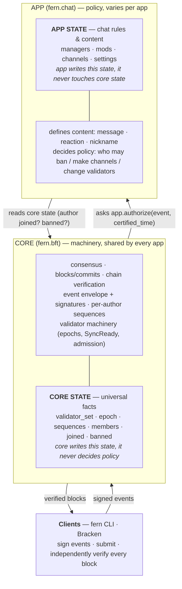
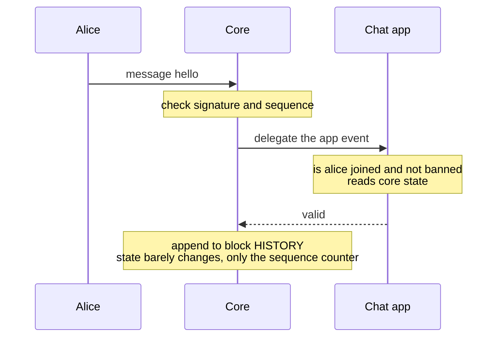
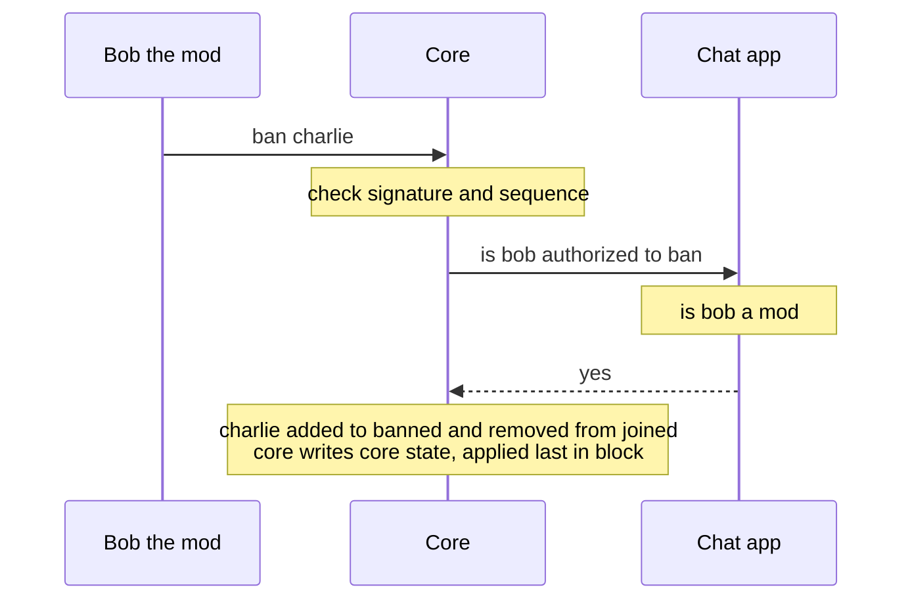
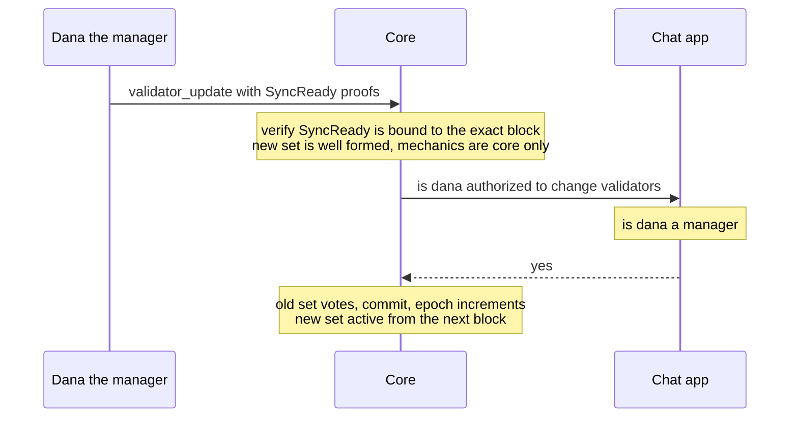

# FERN Protocol–App Boundary

## Status

This document describes the **implemented** separation between the FERN protocol
core and its application modules, on the `FERN-BFT` branch. It is a reference for
how the split works today, not a proposal.

Related documents:

- [bft-spec.md](bft-spec.md) — the normative `fern-bft-1` wire and validation rules.
- [architecture.md](architecture.md) — consensus flow, trust boundaries, failure behavior.
- [python-architecture.md](python-architecture.md) — how the rules map onto the Python packages.
- [validator-hosting.md](validator-hosting.md) — how validators host groups and admit new validators.

## 1. Overview

FERN is a BFT replicated-event **protocol** plus a reference **chat application**.
The protocol core is shared and app-agnostic; each app is a pluggable module that
rides on top of it. A validator declares which app modules it supports and refuses
any group whose `app` it does not implement.

- **One app per group.** The `app` name is committed in genesis (e.g. `chat`;
  a second example app, `chess`, lives in `examples/chess`). In-app features use
  sub-namespaces (e.g. `chat.poll.create`).
- **App modules are linked code**, shipped by the operator (the Cosmos-module /
  Substrate-pallet model). WASM / permissionless app deployment is **out of scope**;
  it could be added later as one app module among native ones, but is not needed for
  the current goals.

The reference chat app is implemented twice and kept in lockstep: in Python
(`fern.apps.chat`, used by validators and the CLI) and in TypeScript (Bracken's
`state.ts`, the browser client). Both produce byte-identical state roots (§13).

A second app, **chess**, lives in `examples/chess` as a worked example of this
boundary: it implements the same `AppModule` interface for a turn-based game and
runs on the unmodified core (its own validator entry point registers it with
`register_app`). It exists to show the core hosts a genuinely different,
non-chat app with no changes to `src/fern`.

## 2. The dividing principle

Two complementary lenses:

- **Machinery vs policy.** The core is machinery — it orders, finalizes, certifies,
  verifies, replay-protects, and manages validators. The app is policy — it decides
  what is allowed and what it means. The core delegates every policy decision to the
  app; the app relies on the core for integrity.
- **Facts vs rules.** Universal group *facts* (who validates, each author's sequence,
  who is a member) live in the core. *Rules* (roles, permissions, who may act, content
  semantics) live in the app.

The core has **no roles and no authorization policy.** It answers *"in what order, is
it final, is it certified, is it replay-protected, who validates?"* The app answers
*"is this allowed, and what does it do?"*

## 3. What the core owns

The core (`fern.bft`) is the consensus and integrity layer, shared by every app:

- **Consensus engine** — propose/prevote/precommit, rounds, locks, votes, nil-voting,
  valid-round proofs, round catch-up, equivocation handling.
- **Event envelope** — canonical encoding, signatures, event IDs.
- **Per-author sequences** — replay protection; the core rejects a replay before the
  app ever sees it.
- **Validator machinery** — epochs, the `validator_update` *mechanism* (readiness-proof
  validation, set shape, epoch increment), statuses, manifests, hosting attestations,
  safe admission.
- **Chain** — blocks, commits, chain verification, state/history roots, logical bytes.
- **Identity** — group key, chain ID, genesis structure.
- **Membership substrate** — `members` / `joined` / `banned` and the
  join/leave/invite/kick/ban/unban mechanisms.

### Core state

`CoreState` holds the universal facts:

```text
group · chain_id · validator_set · members · joined · banned
sequences · metadata (name, description) · public · app
```

### Core event types (bare names)

| Event | Kind | Notes |
|---|---|---|
| `genesis` | special | signed by the group key; seeds the state |
| `join`, `leave` | self-service | authorized by the core against membership state |
| `invite`, `kick`, `ban`, `unban` | membership | app-authorized; **boundary** events |
| `validator_update` | consensus | app-authorized; **boundary**; core checks the mechanism |
| `metadata_update` | attribute | app-authorized; ordinary (not boundary) |

## 4. What the app owns (chat)

The chat app (`fern.apps.chat`) owns everything chat-specific:

- **Roles** — `managers` (supreme) and `mods` (delegated moderation). These are
  app state, not core state.
- **Channels and settings** — `channels`, and `settings` (default/system channel).
- **Content** — `chat.message`, `chat.reaction`, `chat.nickname_set`.
- **All authorization policy** — the app decides who may act, for *every* event
  including core events.

### App state

`ChatState` holds:

```text
managers · mods · channels · settings
```

### Chat event types (dotted names)

| Event | Kind | Notes |
|---|---|---|
| `chat.message`, `chat.reaction`, `chat.nickname_set` | content | joined + not-banned |
| `chat.channel_create`, `chat.channel_delete` | reference | app-authorized; **boundary** |
| `chat.channel_update`, `chat.settings_update` | attribute | app-authorized; ordinary |
| `chat.manager_add`, `chat.manager_remove` | authority | managers only; **boundary** |
| `chat.mod_add`, `chat.mod_remove` | authority | managers only; **boundary** |

### The `AppModule` interface

The core defines the interface; the app implements it. The core never imports app
code — the dependency points one way (`app → core`).

```python
class AppState(Protocol):
    def to_dict(self) -> dict[str, object]: ...

class AppModule(Protocol):
    name: str
    boundary_types: frozenset[str]
    def initial_state(self, genesis_content) -> AppState
    def state_from_dict(self, value) -> AppState
    def validate_genesis(self, genesis_content) -> None
    def validate_semantics(self, event) -> None
    def validate_for_state(self, core, app, event, certified_time_ms) -> None
    def authorize(self, core, app, event, certified_time_ms) -> bool
    def apply_event(self, core, app, event, certified_time_ms) -> AppState
```

## 5. State and the state root

A group's complete deterministic state is `GroupState` = `CoreState` + the app's
`AppState`. The **state root** is a single SHA-256 over the canonical combined state:

```text
root = sha256( canonical_json( ["fern-bft-state", combined_dict] ) )
```

The core contributes its keys and the app contributes its keys; they are merged and
canonically serialized (keys sorted), so the root commits to both layers. There is no
partitioning. The combined key set is:

```text
protocol · group · chain_id · validator_set · members · joined · banned
sequences · metadata · public · app          (core)
managers · mods · channels · chat_settings   (chat app)
```

The two implementations represent this state differently but serialize it identically:

- **Python** splits the state into `CoreState` and `ChatState` objects. `GroupState`
  exposes the core fields (`validator_set`, `joined`, `banned`, `sequences`, …) as
  delegating properties, so callers read `state.validator_set` directly; chat-only
  fields are reached via `state.app` (a `ChatState`).
- **Bracken** keeps a single flat `GroupState` with all fields. This is appropriate
  for a single-app client; only the field set and authorization logic had to match.

Both produce the same root for the same history (§13).

## 6. Authorization

Authorization is split between the core (mechanical eligibility) and the app (policy).

**Core — join/leave eligibility.** `join` requires the author to be not-banned and
either the group is `public` or the author is already a member; `leave` is always
allowed. These are mechanical checks against core membership state, so the core
performs them directly.

**App — everything else.** For all other events (core governance events *and* app
events), the core calls:

```text
app.authorize(core_state, app_state, event, certified_time) -> bool
```

The app receives the **whole event** (so it can inspect the type and content — which
channel, which target) and the **certified time** (so it can handle expiring bans and
time-locked authority). Passing the full event rather than a `(signer, capability)`
pair is deliberate: real governance is context-dependent (a moderator of *this*
subforum, a role valid *during this window*), and the app is best placed to evaluate
that context.

The core enforces only *mechanical* validity — signature, sequence, group match,
not-banned, and (for `validator_update`) readiness proofs and set shape. It never
decides who is allowed.

### Chat role hierarchy

Managers are supreme; mods are delegated moderation — mirroring Discord
owner→moderators and Matrix power levels. The chat app's `authorize` is:

```text
content events (message/reaction/nickname):  signer joined and not banned
any other event:                             signer in managers  → allow
                                             signer in mods and event in MOD_ALLOWED → allow
                                             otherwise → deny
```

where `MOD_ALLOWED` = invite, kick, ban, unban, channel_create/update/delete,
settings_update. So:

- **Managers** can do everything: change validators, manage managers/mods, moderate,
  update metadata.
- **Mods** can moderate (ban/kick/invite/unban, manage channels and settings) but
  cannot touch validators, roles, or group metadata.

A manager's ability to change validators comes from the chat app authorizing
`validator_update` for managers — the core only enforces the *mechanism*. This is what
lets another app implement a different governance model (e.g. vote-based validator
changes) without any protocol change.

## 7. Boundary events

A **boundary event** is applied last in a block, and at most one appears per block.

**Criterion:** an event is a boundary event if it is an authority-gated change to the
*validity domain* — who may act, what may be referenced, who validates — so that its
effect settles at a clean block boundary and a block's validity never depends on the
proposer's intra-block ordering. Removals (`ban`, `channel_delete`) are the canonical
case: applied mid-block they would retroactively invalidate earlier ordinary events.
Authority additions (`mod_add`) are boundary too, so `mod_add` / `mod_remove` cannot
interact order-dependently within a block.

"Boundary" is orthogonal to core/app ownership. The full boundary set is the core's
boundary types plus the app's declared `boundary_types`:

| Boundary | Ordinary |
|---|---|
| `invite`, `kick`, `ban`, `unban` (membership) | `join`, `leave` (self-service) |
| `validator_update` (consensus) | `chat.message`, `chat.reaction`, `chat.nickname_set` (content) |
| `chat.manager_add/remove`, `chat.mod_add/remove` (authority) | `metadata_update`, `chat.channel_update`, `chat.settings_update` (attributes) |
| `chat.channel_create`, `chat.channel_delete` (references) | |

`join`/`leave` are deliberately ordinary (self-service; this allows join-and-post in
one block). The attribute updates are gated but not boundary — no event's validity
depends on a name or pointer.

**Enforcement differs by implementation:**

- **Python** enforces the rule in `execute_events`, which authoritatively checks the
  boundary slot and always runs before any candidate/proposal/commit is accepted. The
  block-structure verifier (`verify_candidate`) does *not* re-check it, keeping the
  consensus kernel app-agnostic.
- **Bracken** flattens a block's events by position in `deriveGroupState` and does not
  re-derive the slot, so the boundary-slot check lives in `verifyCommitEvidence`.

## 8. Genesis

Genesis is signed by the group key and seeds the state. Its content splits the same
way as everything else:

- **Core (bare) fields:** `chain_id`, `name`, `description`, `public`, `founder`,
  `validators`, `fault_tolerance`, `app`. The core validates these and rejects bare
  fields it does not recognize, and rejects any dotted field whose namespace is not the
  declared `app`.
- **Chat (dotted) fields:** `chat.channels` (non-empty), `chat.default_channel`,
  `chat.system_channel`, `chat.managers`, `chat.mods`. The chat app validates and
  parses these. `chat.managers` defaults to `[founder]` if absent; `chat.mods` defaults
  to empty.

The founder is the first member and (by default) the first manager.

## 9. Event types and namespacing

- **Bare names are core** (`ban`, `validator_update`); **dotted names are app**
  (`chat.message`). Bare names are reserved for the core permanently; app names are
  simple lowercase identifiers; sub-namespaces (`chat.poll.create`) are allowed.
- **Genesis content** follows the same rule: bare keys are core, `<app>.*` keys are the
  app's.
- **Foreign-namespace events are rejected.** A dotted event whose namespace is not the
  group's `app` is invalid. (The legacy behavior of carrying such events opaquely was
  removed; there are no undefined-behavior events in state.)

## 10. Validator-set changes

`validator_update` replaces the complete validator set and increments the epoch. The
split is the same as elsewhere:

- **Core owns the mechanism** — it validates every new validator's `SyncReady` proof
  (bound to the exact pre-transition checkpoint), checks the new set is well-formed,
  and applies the epoch increment. The *old* set finalizes the transition block; the
  new set is active from the next height.
- **App owns the authorization** — the core asks `app.authorize(...)` who may trigger
  it. For chat, only managers may.

See [bft-spec.md](bft-spec.md) §9 and [validator-hosting.md](validator-hosting.md) for
the full transition and admission rules.

## 11. The boundary, illustrated

### Layers and ownership



Two arrows cross the boundary, and that is the entire interface: the **app reads core
state** to validate events, and the **core asks the app** to authorize them. Each layer
writes only its own state. Messages and other content live in the **history log**
(committed via the history root), not in the state snapshot.

### Three events crossing the boundary

**Alice posts a message** — app content, app reads core state, goes to history:



**Mod Bob bans Charlie** — core-state change, app-authorized, boundary event:



**Manager Dana changes the validator set** — core mechanism, app-authorized:



Same shape every time: the core does the mechanics and writes core state; the app
supplies the policy decision (and reads core state when it needs to). The only
difference is *which* state changes and *who* writes it.

## 12. Code layout

### Python

- `fern/bft/app.py` — the `AppModule` / `AppState` protocols, `CoreState`,
  `GroupState`, `ChainHead`, and the orchestration (`initial_state_from_genesis`,
  `genesis_chain_head`, `validate_event_for_state`, `apply_event`, `execute_events`,
  `boundary_types_for`).
- `fern/apps/__init__.py` — the app registry (`register_app`, `get_app`,
  `is_supported`, `register_builtins`).
- `fern/apps/chat.py` — `ChatApp` + `ChatState`; all chat semantic validation, genesis
  validation, authorization, and state transitions.
- `fern/events/semantic.py` — core-event validation plus shared field helpers
  (`string_field`, `pubkey_field`, `int_field`, …) reused by the chat app.
- `fern/bft/constants.py` — `CORE_EVENT_TYPES`, `SELF_SERVICE_CORE_TYPES`,
  `AUTHORIZED_CORE_TYPES`, `CORE_BOUNDARY_TYPES`.
- `fern/events/types.py` — the `ProtocolTypes` / `ChatTypes` registries.

**Registry, not threading.** The orchestration looks the app up by the `app` name
committed in state (`get_app(state.core.app)`) rather than threading an `AppModule`
through every constructor. `fern.bft` imports only the registry; `register_builtins()`
defers the chat import so importing the registry never pulls in app code. The CLI, the
validator entry point, and the test `conftest.py` call `register_builtins()`.

**Validator refusal.** On `bootstrap`, the registry lookup raises
`AppNotSupportedError` for an unknown `app`, and the WebSocket handler also checks
`is_supported` explicitly for a clear error.

**CLI commands** for role management are `manager-add` / `manager-remove` / `mod-add` /
`mod-remove` (the old `admin-add` / `admin-remove` are gone).

### Example apps (out-of-tree)

`examples/chess` is a complete second application built against this interface
without modifying `src/fern`: a pure `board` engine, the `ChessApp` / `ChessState`
module, a client, and a validator entry point (`run_cluster.py`). It registers
with `register_app(CHESS_APP)`. Because the stock validator calls
`register_builtins()` — which registers chat only — a chess-aware entry point is
what lets a validator host `app: "chess"` groups; the core then delegates to the
chess module exactly as it does to chat.

### Bracken (TypeScript)

- `src/fern/state.ts` — `GroupState` (flat), genesis validation, authorization
  (core join/leave eligibility + chat policy), state transitions, `computeStateRoot`.
- `src/fern/bft.ts` — `BOUNDARY_TYPES` and the boundary-slot check inside
  `verifyCommitEvidence`; the `validator_update` mechanism (`verifyValidatorTransition`).
- `src/hooks/useBracken.ts`, `src/App.tsx`, and the components — group creation
  (`chat.managers`), role-management actions, and the two-tier member/profile UI.

## 13. Interoperability

The Python and TypeScript implementations are verified to agree: the same genesis, and
the same chain of events (`chat.message`, `metadata_update`, `chat.nickname_set`,
`ban`, `chat.mod_add`, `chat.channel_create`, `chat.manager_add`), produce an identical
state root in both. This is the critical guarantee that Bracken and the validators
share one history.

## 14. Design notes and caveats

- **Foreign-namespace events are rejected**, not carried opaquely (a behavior change
  from the legacy DAG-era code).
- **Roles do not require membership.** `chat.manager_add` / `chat.mod_add` do not
  require the target to be a joined member. A mod who has not joined cannot post
  (content authorization checks `joined`) but can still moderate.
- **Managers are supreme by app policy, not core rule.** The chat app's `authorize`
  returns true for managers on any action; another app could make its top role weaker.
  The core only enforces the validator-update *mechanism*.
- **`metadata_update` is ordinary** (not boundary): it changes an attribute, not the
  validity domain.
- **The boundary check lives in different places** in the two implementations
  (`execute_events` in Python, `verifyCommitEvidence` in Bracken) because their
  verification flows differ; both enforce the same rule.
- **Single-app assumption in app code.** The chat module and CLI use
  `assert isinstance(app, ChatState)` (the chess example does the same with
  `ChessState`). Fine while a process hosts one app; a future multi-app validator
  would want proper per-app dispatch. The core itself never assumes the app state
  type (it stays opaque).

## 15. Future work

- **Fine-grained roles / permission bits** (Discord-style). The `authorize(event)`
  interface already supports this; chat ships with flat `managers` + `mods`.
- **Role naming** (manager/mod vs owner/admin) — cosmetic, app-level.
- **Gated join / join-with-approval** — model as app state (`join_request` + approval)
  gating the core `join` via `authorize`, if ever needed.
- **Scheduled / automatic events** — no native timer. Start with an external trigger
  (a validator or bot submits the event once certified time passes); add an optional
  `app.on_block(certified_time)` hook (Cosmos BeginBlocker-style) if a real app needs
  automatic expiration.
- **Reference-into-history validation** — the state-only interface cannot check that a
  referenced past event exists (e.g. a reaction's target message), so dangling
  references are accepted. Add a "does event X exist?" query if strict integrity is
  needed.
- **Multiple apps per group** — currently one app per group.
- **WASM / permissionless app deployment** — out of scope; could be added later as one
  app module among native ones.
