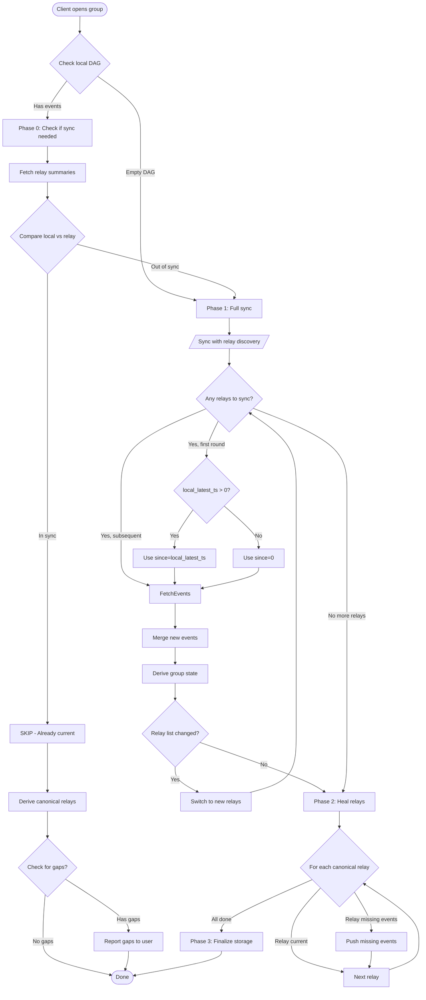
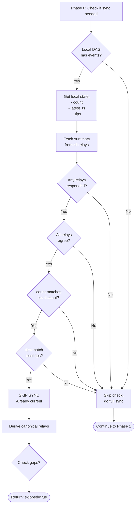
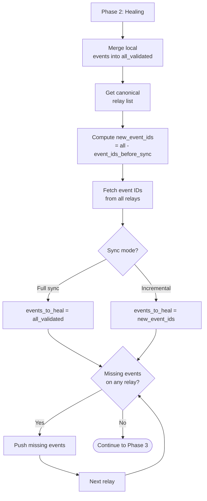
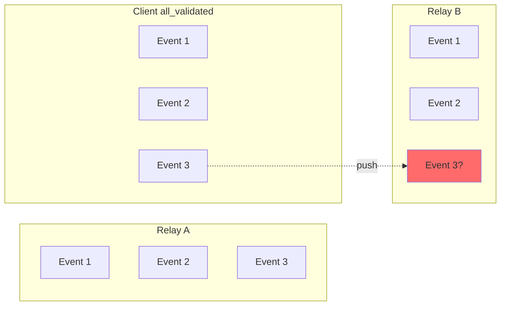
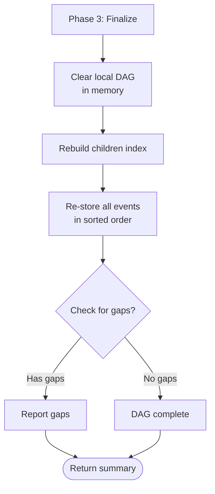
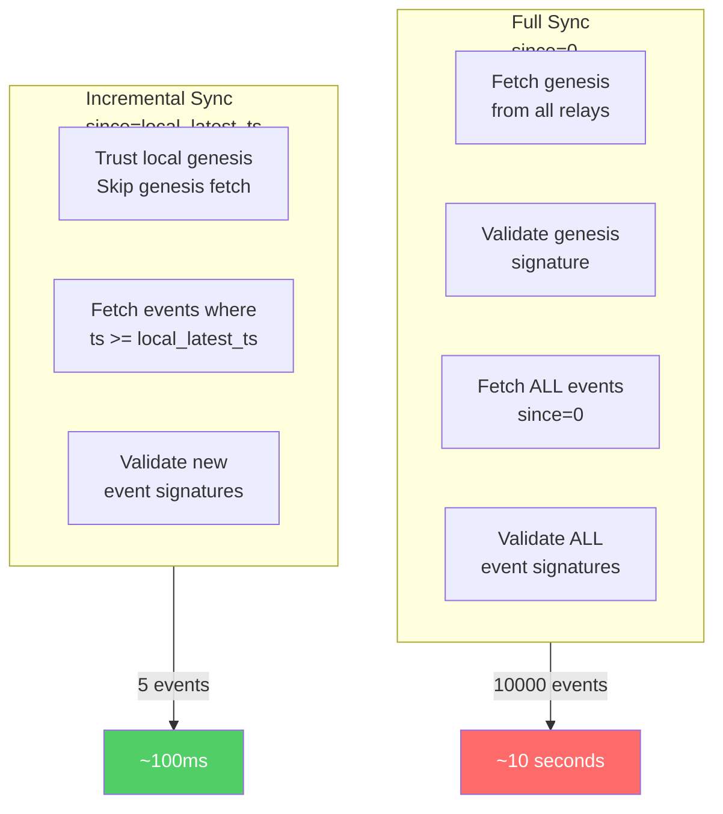
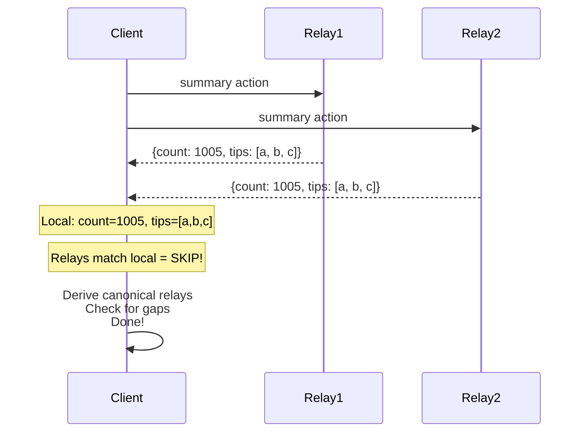

# FERN Sync Process

This document describes the sync-and-heal process in FERN, including the incremental sync optimization.

---

## Overview

The sync process ensures a client's local DAG matches the canonical relay state. It handles:

1. **Relay discovery** - finding the authoritative relay set from group state
2. **Event synchronization** - downloading missing events from relays
3. **Gap healing** - ensuring all relays have identical event history
4. **Incremental optimization** - avoiding full history downloads when possible

---

## Main Sync Flow



---

## Phase 0: Sync Skip Check

This phase optimizes by avoiding unnecessary full history downloads when the client is already in sync.



---

## Phase 1: Sync with Relay Discovery

The sync loop handles relay migration by discovering canonical relays through the DAG itself.

```mermaid
flowchart TD
    Start[Phase 1: Sync Loop] --> Init[Init:\n- current_relays = hint_relays\n- seen_relays = {}\n- all_validated = {}]
    
    Init --> LoopTop{current_relays\nis empty?}
    
    LoopTop -->|No| RoundStart[Start sync round]
    LoopTop -->|Yes| Done1([Continue to Phase 2])
    
    RoundStart --> TrackUsed[Track relays used\nthis round]
    TrackUsed --> SyncMode{Local events\nexist?}
    
    SyncMode -->|Yes| SetSince[since = local_latest_ts]
    SyncMode -->|No| SetFull[since = 0]
    
    SetSince --> FetchEvents
    SetFull --> FetchEvents
    
    FetchEvents[Fetch & validate\nevents from relays] --> Merge[Merge into\nall_validated]
    Merge --> CheckGood{Any good\nrelays?}
    
    CheckGood -->|No| NoRelays[No working relays]
    NoRelays --> Done1
    
    CheckGood -->|Yes| TempStore[Store events in DAG\ntemp to derive state]
    TempStore --> DeriveState[Derive group state\nget canonical relays]
    DeriveState --> CompareRelays{derived == used\nthis round?}
    
    CompareRelays -->|Yes| Stable[Relay list stable]
    Stable --> Done1
    
    CompareRelays -->|No| CheckMigration{New relays\nin derived?}
    
    CheckMigration -->|Yes| SwitchRelays[Switch to\ncanonical relays]
    SwitchRelays --> ClearTemp[Clear temp DAG\nstorage]
    ClearTemp --> LoopTop
    
    CheckMigration -->|No| Stable2[Already synced\nall relays]
    Stable2 --> Done1
```

---

## Phase 2: Healing

Healing ensures all canonical relays have identical event history. For **full sync**, all events are compared. For **incremental sync**, only the new events received during this sync are healed (to avoid incorrectly flagging old events as missing).



---

## Healing Detail



---

## Phase 3: Finalize Storage



---

## Incremental vs Full Sync



---

## Summary Response

The `sync_and_heal` function returns a summary dict:

```python
summary = {
    "hint_relays": ["ws://relay1:8787", ...],  # Relays initially contacted
    "canonical_relays": ["ws://relay1:8787", ...],  # Final authoritative relays
    "bad_relays": ["ws://relay2:8787", ...],  # Relays that failed/changed genesis
    "sync_rounds": 2,  # Number of relay discovery rounds
    "total_events": 1005,  # Total events after sync
    "invalid_events": 0,  # Events rejected during validation
    "healed_events": 3,  # Events pushed to lagging relays
    "gaps": [],  # Missing parent event IDs
    "skipped": False,  # True if sync was skipped (already in sync)
}
```

---

## Key Optimization: Summary Check


