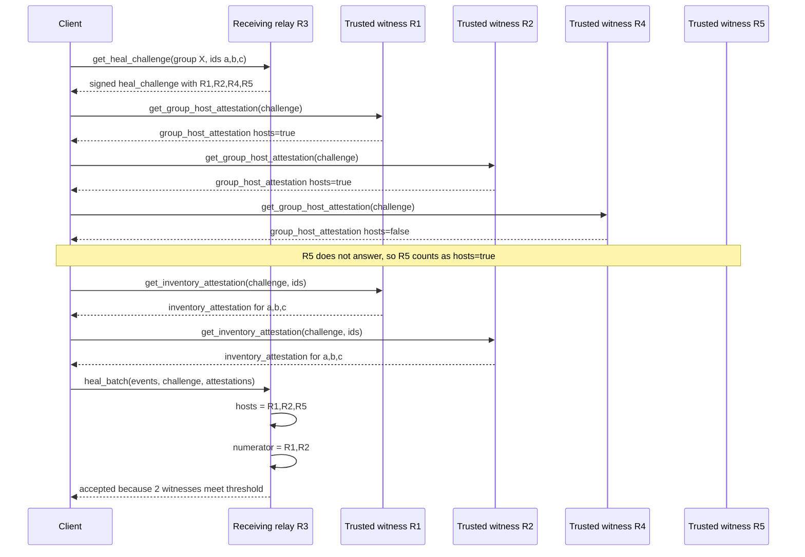
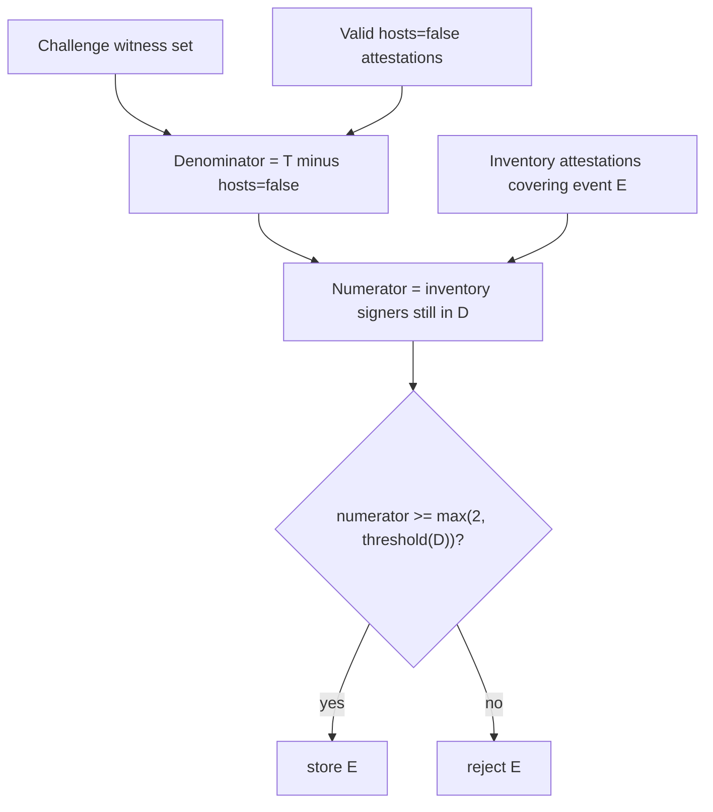

# Trusted Heal Plan

This plan closes the main `heal` spam loophole without requiring relay-to-relay
event transfer. The receiving relay chooses who it trusts. The client carries
signed attestations from those trusted relays. The receiving relay verifies the
signatures and stores only events that meet its local witness threshold. Fast
signed heal requires at least two trusted inventory witnesses.

The goal is not to prove that events are worthwhile. FERN accepts that no relay
can objectively decide that from a valid signed event alone. The goal is narrower:
allow fast sync for groups with real trusted relay overlap while preventing
anonymous clients from using `heal` as an unlimited bypass around `publish` rate
limits. Groups with only one trusted witness still work, but they use slow
rate-limited heal.

## Summary

For fast `heal_batch`, the receiving relay requires evidence from relays it
already trusts.

1. Client asks the receiving relay for a `heal_challenge`.
2. Receiving relay returns a signed challenge containing its trusted witness set
   for this batch.
3. Client asks every trusted witness in the challenge whether it hosts, or is
   willing to witness, the group for this heal.
4. Witnesses return signed `group_host_attestation`s saying `hosts: true` or
   `hosts: false`.
5. Missing host answers count as `hosts: true`, so the client cannot shrink the
   denominator by omitting inconvenient relays.
6. Client asks reachable relays that count as hosts for signed
   `inventory_attestation`s covering the event IDs.
7. Receiving relay accepts each event only if enough trusted host relays signed
   inventory attestations for that event.
8. At least two trusted inventory witnesses are required for fast admission. If
   fewer than two witnesses attest, the client must use slow rate-limited `heal`.
9. If `heal_batch` admits new events, the receiving relay promptly issues a new
   `group_status` so subscribed clients can see the store change.

There is no relay-to-relay communication in the fast path. The client is the
courier for all signed evidence.



## Terms

- **Receiving relay**: the relay being asked to store events.
- **Trusted witness relay**: a relay pubkey in the receiving relay's local trust
  configuration.
- **Challenge witness set**: the trusted witness relays selected by the receiving
  relay for one `heal_challenge`.
- **Group host attestation**: a relay-signed yes/no answer saying whether the
  relay hosts or is willing to witness the group for this heal challenge.
- **Inventory attestation**: a relay-signed claim that the relay has specific
  event IDs in its normal event store.
- **Fast heal**: high-throughput `heal_batch` admitted by trusted inventory
  quorum.
- **Slow heal**: rate-limited `heal` fallback for events without enough trusted
  inventory witnesses.

The group's canonical relay set does not define trust. A canonical relay only
matters for this plan if the receiving relay also has that relay in its own
trusted witness configuration.

In this plan, `hosts: true` means "count this trusted relay as a witness for
this group in this challenge." It does not mean the relay is canonical according
to group state.

## Relay Trust Configuration

Each relay has a local, operator-configured trust set:

```json
{
  "trusted_witness_relays": [
    {
      "url": "wss://r1.example/",
      "pubkey": "<relay pubkey hex>"
    },
    {
      "url": "wss://r2.example/",
      "pubkey": "<relay pubkey hex>"
    }
  ]
}
```

This trust set is:

- local to the receiving relay,
- directional,
- independent of group state,
- not modified by `genesis` or `relay_update` events.

This prevents an attacker-created group from choosing the relays that the
receiving relay trusts.

## Threshold Rule

The receiving relay computes a dynamic denominator for each challenge.

```text
T = challenge witness set chosen by the receiving relay
H_false = relays in T with valid group_host_attestations where hosts=false
D = T - H_false
```

`D` is the denominator. Relays with `hosts=true` remain in `D`. Relays with no
host answer also remain in `D`.

For each event ID:

```text
A(event) = relays in D with valid inventory_attestations covering event
required = threshold_required(len(D))

accept event iff len(A(event)) >= required
```

Recommended default:

```text
if n == 0:
    reject
else:
    threshold_required(n) = max(2, ceil(2 * n / 3))
```

More generally, for a challenge threshold `{num, den, min}`:

```text
threshold_required(n) = max(min, ceil(num * n / den))
```

Examples:

| Denominator | Required inventory attestations |
|---:|---:|
| 0 | reject |
| 1 | 2 (impossible) |
| 2 | 2 |
| 3 | 2 |
| 4 | 3 |
| 5 | 4 |
| 10 | 7 |

Operators may configure a stricter rule, such as `ceil(3 * n / 4)` or
`ceil(4 * n / 5)`.

This preserves the desired gradient:

- a one-witness group can work through slow heal, but not fast heal,
- fast heal starts once two trusted witnesses can attest,
- larger witness sets require a quorum,
- missing host answers do not reduce the denominator.

## Protocol Objects

All objects below are signed relay protocol objects. They are not FERN DAG
events and do not affect event IDs.

### `heal_challenge`

Issued by the receiving relay before a fast `heal_batch`.

```json
{
  "type": "heal_challenge",
  "group": "<group pubkey hex>",
  "receiver": "<receiving relay pubkey hex>",
  "ids_hash": "<sha256 of sorted newline-joined event ids>",
  "count": 3,
  "trusted_witnesses": [
    {
      "relay": "<witness relay pubkey hex>",
      "url": "wss://r1.example/"
    }
  ],
  "threshold": {
    "kind": "ratio",
    "num": 2,
    "den": 3,
    "min": 2
  },
  "nonce": "<random hex>",
  "ts": 1711234567,
  "expires": 1711234867,
  "sig": "<receiving relay signature hex>"
}
```

Canonical signing payload:

```text
[
  type,
  group,
  receiver,
  ids_hash,
  count,
  trusted_witnesses,
  threshold,
  nonce,
  ts,
  expires
]
```

`trusted_witnesses` MUST be sorted by relay pubkey before signing.

The `heal_challenge` binds the batch to:

- one group,
- one receiving relay,
- one set of event IDs,
- one receiver-chosen witness set,
- one threshold rule,
- a short expiry window.

### Challenge ID

Other attestations refer to the challenge by hash:

```text
challenge_id = sha256_hex(canonical signing payload of heal_challenge)
```

### `inventory_attestation`

Issued by a trusted witness relay that has some or all requested events.

```json
{
  "type": "inventory_attestation",
  "group": "<group pubkey hex>",
  "relay": "<witness relay pubkey hex>",
  "receiver": "<receiving relay pubkey hex>",
  "challenge": "<challenge_id hex>",
  "ids_hash": "<sha256 of sorted newline-joined attested event ids>",
  "count": 3,
  "ts": 1711234567,
  "expires": 1711234867,
  "sig": "<witness relay signature hex>"
}
```

Canonical signing payload:

```text
[type, group, relay, receiver, challenge, ids_hash, count, ts, expires]
```

The witness relay MUST sign only event IDs that it currently stores in its normal
event store. It MUST NOT sign IDs it has only in a temporary cache.

An `inventory_attestation` is a positive per-event claim:

```text
I have these event IDs and am willing to witness them for this receiver's
challenge.
```

### `group_host_attestation`

Issued by a trusted witness relay to answer whether it hosts, or is willing to
witness, the group for this challenge.

```json
{
  "type": "group_host_attestation",
  "group": "<group pubkey hex>",
  "relay": "<witness relay pubkey hex>",
  "receiver": "<receiving relay pubkey hex>",
  "challenge": "<challenge_id hex>",
  "hosts": true,
  "ts": 1711234567,
  "expires": 1711234867,
  "sig": "<witness relay signature hex>"
}
```

Canonical signing payload:

```text
[type, group, relay, receiver, challenge, hosts, ts, expires]
```

If `hosts` is `true`, the relay is counted in the denominator for this
challenge.

If `hosts` is `false`, the relay is removed from the denominator for this
challenge.

A missing `group_host_attestation` is treated as `hosts: true`. This is the
fail-closed rule that prevents a client from lowering the threshold by omitting
answers from inconvenient relays.

`hosts: false` is a group-level opt-out, not a per-event missing answer. A relay
MUST NOT sign `hosts: false` merely because it lacks the requested event IDs. If
the relay hosts the group but does not have some requested IDs, it should sign
`hosts: true`, report those IDs as missing from inventory, and remain in the
denominator.

The relay may sign `hosts: false` because it does not know the group, does not
consider itself a witness for the group, is still syncing too much of the group
to act as a witness, or has local policy against witnessing the group.

A relay MUST NOT sign `hosts: false` merely because it is temporarily overloaded,
offline for inventory lookup, rate-limiting the client, or otherwise unable to
answer inventory requests. Temporary inability to answer inventory requests does
not shrink the denominator.

In plain language, the group host attestation answers:

```text
Should I be counted as one of the receiving relay's trusted relays that hosts
this group for this heal challenge?
```

## Actions

### `get_heal_challenge`

Client to receiving relay:

```json
{
  "action": "get_heal_challenge",
  "group": "<group pubkey hex>",
  "ids": ["<event id hex>", "<event id hex>"]
}
```

Receiving relay response:

```json
{
  "type": "heal_challenge",
  "heal_challenge": { "...": "heal_challenge" }
}
```

The receiving relay SHOULD reject challenges that exceed local batch limits:

- maximum event count,
- maximum total estimated bytes,
- invalid or duplicate event IDs,
- group storage quota already exhausted.

### `get_group_host_attestation`

Client to a relay listed in `heal_challenge.trusted_witnesses`:

```json
{
  "action": "get_group_host_attestation",
  "heal_challenge": { "...": "heal_challenge" }
}
```

Witness relay response:

```json
{
  "type": "group_host_attestation",
  "group_host_attestation": { "...": "group_host_attestation" }
}
```

The witness relay SHOULD verify before responding:

1. The `heal_challenge` signature is valid.
2. The challenge has not expired.
3. The witness relay's own pubkey appears in `trusted_witnesses`.

The response contains `hosts: true` if the relay hosts, or is willing to witness,
the group for this challenge. It contains `hosts: false` only if the relay should
not be counted as a witness for this group. Temporary inability to answer
inventory requests MUST NOT be represented as `hosts: false`.

The client SHOULD request this from every relay in
`heal_challenge.trusted_witnesses` and SHOULD forward every response it obtains
to the receiving relay. If a response is missing, the receiving relay treats
that relay as `hosts: true`.

### `get_inventory_attestation`

Client to a relay listed in `heal_challenge.trusted_witnesses`:

```json
{
  "action": "get_inventory_attestation",
  "heal_challenge": { "...": "heal_challenge" },
  "ids": ["<event id hex>", "<event id hex>"]
}
```

Witness relay response if it has at least one requested event:

```json
{
  "type": "inventory_attestation",
  "inventory_attestation": { "...": "inventory_attestation" },
  "ids": ["<event id covered by the attestation>"],
  "missing": ["<event id not covered by the attestation>"]
}
```

Witness relay response if it hosts the group for this challenge but has none of
the requested events:

```json
{
  "type": "inventory_missing",
  "missing": ["<event id not covered by an attestation>"]
}
```

If the witness relay hosts, or is willing to witness, the group for this
challenge but lacks some or all requested IDs, it SHOULD return those IDs in
`missing` and SHOULD NOT return a `hosts: false` group host attestation. Missing
inventory does not remove the relay from the receiving relay's denominator.
`inventory_missing` is not forwarded to the receiving relay as evidence; if no
valid `hosts: false` attestation exists, that relay remains in the denominator.

The witness relay SHOULD verify before responding:

1. The `heal_challenge` signature is valid.
2. The challenge has not expired.
3. The witness relay's own pubkey appears in `trusted_witnesses`.
4. The supplied `ids` match the challenge `ids_hash`.

The witness relay does not need to trust the receiving relay. Signing is a local
policy decision.

### `heal_batch`

Client to receiving relay:

```json
{
  "action": "heal_batch",
  "heal_challenge": { "...": "heal_challenge" },
  "events": [{ "...": "full event object" }],
  "group_host_attestations": [
    { "...": "group_host_attestation" }
  ],
  "inventory_attestations": [
    {
      "inventory_attestation": { "...": "inventory_attestation" },
      "ids": ["<event id hex>"]
    }
  ]
}
```

Receiving relay response:

```json
{
  "type": "heal_batch_result",
  "stored": ["<event id hex>"],
  "already_have": ["<event id hex>"],
  "rejected": [
    {
      "id": "<event id hex>",
      "reason": "insufficient_trusted_witnesses"
    }
  ]
}
```

## Receiving Relay Verification

For a `heal_batch`, the receiving relay MUST:

1. Verify the `heal_challenge` was signed by itself.
2. Reject expired challenges.
3. Verify the event IDs in `events` are unique.
4. Verify the sorted event IDs in `events` match the challenge `ids_hash` and
   `count`.
5. Verify each event's structure, hash, signature, size, and `group` field.
6. Ignore attestations from relays not listed in the challenge witness set.
7. Verify every group host and inventory attestation signature.
8. Reject expired attestations.
9. Verify each attestation refers to the same `challenge_id`.
10. Verify each inventory attestation's `ids_hash` and `count` against the
    attached `ids`.
11. Verify all attached inventory `ids` are present in the challenge batch.
12. Treat conflicting evidence from the same relay as invalid evidence. If a
    relay supplies both `hosts: false` and an inventory attestation, or supplies
    multiple conflicting group host attestations, ignore its inventory
    attestation and do not apply its `hosts: false` attestation.
13. Compute the denominator by starting with the challenge witness set and
    subtracting only relays with valid, non-conflicting `hosts: false`
    group host attestations. Relays with `hosts: true` remain in the
    denominator. Relays with no group host attestation also remain in the
    denominator.
14. Reject fast storage if the denominator is zero.
15. For each new event, count valid inventory attestations from relays still in
    the denominator.
16. Store the event only if the threshold passes and local quotas allow it.

Relays still do not perform semantic group validation or DAG connectedness
checks. They only verify event integrity, relay signatures, local trust policy,
and local resource limits.



## Heal Visibility

Fast heal must not be invisible to clients for long. When a `heal_batch` stores
one or more new events, the receiving relay MUST issue a fresh `group_status`
promptly for that group and push it to subscribed clients.

The relay MAY coalesce multiple accepted `heal_batch` writes into one
off-cadence `group_status` over a short implementation-defined window, but it
MUST NOT wait for the normal periodic cadence if new events were admitted.

Clients may notice this as set growth without matching live event pushes. That
is not automatically a fault: legitimate new-relay seeding and gap repair have
the same shape. The point is only that `heal_batch` ingress should be visible
through the existing `group_status` mechanism.

Relays SHOULD retain internal admission provenance for every event stored by
`heal_batch`, including the trusted witness pubkeys whose inventory attestations
caused the event to pass. This provenance does not affect event IDs and is not
part of the FERN DAG. It is used for local operator audits, trust revocation,
and cleanup.

## Example

R3's challenge witness set:

```text
T = R1, R2, R4, R5
```

Client returns:

```text
R1 group_host_attestation hosts=true
R2 group_host_attestation hosts=true
R4 group_host_attestation hosts=false
R5 missing group_host_attestation
R1 inventory_attestation for a,b,c
R2 inventory_attestation for a,b,c
```

R4 is removed from the denominator. R5 is missing, so it counts as `hosts:true`
and remains in the denominator:

```text
D = R1, R2, R5
```

For event `a`:

```text
A(a) = R1, R2
```

With the default threshold:

```text
threshold_required(3) = 2
```

R3 accepts `a`, `b`, and `c`.

## Security Properties

### Prevents Client-Chosen Denominators

The client cannot decide which relays count. The receiving relay chooses the
challenge witness set. Only signed `hosts: false` answers remove relays from the
denominator. Missing host answers stay in the denominator.

### Prevents Attacker-Owned Canonical Relay Bypass

An attacker can create a group whose canonical relay set contains attacker-owned
relays. That does not matter unless the receiving relay has those relays in its
own trusted witness set.

### One-Witness Groups Use Slow Heal

If all other trusted witnesses sign `hosts: false`, the denominator can become
one:

```text
T = R1, R2, R3
R1 hosts=true
R2 hosts=false
R3 hosts=false
D = R1
required = 2
```

Fast `heal_batch` cannot pass in this case. The group still works, but missing
history must enter through slow rate-limited `heal`.

### Handles Offline Witnesses

An offline witness does not disappear from the denominator. This prevents
omission attacks. With a ratio threshold, a small number of offline witnesses can
be tolerated.

### Limits Trusted Relay Damage

A relay trusted by the receiver can sponsor data. That is unavoidable in a trust
based system. The practical controls are:

- require at least two trusted inventory witnesses for fast heal,
- require a quorum once more witnesses are in the denominator,
- keep per-group storage quotas,
- keep per-witness and per-IP rate limits,
- track which witness relays caused each event to be admitted,
- allow operator trust revocation and cleanup.

### Makes Fast Heal Visible

After `heal_batch` admits new events, the receiving relay promptly pushes a new
`group_status`. This does not block colluding trusted witnesses, but it prevents
large `heal_batch` ingress from remaining invisible until the next periodic
status tick.


## Remaining Limits

This design does not prove that a group is valuable. It only proves that enough
receiver-trusted witnesses were willing to vouch for the event IDs.

The irreducible failure cases are:

- a one-witness group can only seed through slow rate-limited heal,
- enough trusted witnesses collude or are compromised to meet the threshold,
- local quotas are too high for the operator's storage budget.

Those are policy failures, not event-validation failures.

## Implementation Notes

- `publish` should remain per-IP rate-limited. That is the public path for new
  events.
- Slow `heal` should remain rate-limited and treated as a fallback path for
  events without at least two trusted inventory witnesses. Its default rate
  should be the same public-ingress class as `publish`, unless the operator
  explicitly configures a different fallback rate.
- `heal_batch` should have max event count and max byte limits.
- A relay that stores new events through `heal_batch` must issue a fresh
  `group_status` promptly, with short coalescing allowed to avoid status spam.
- Challenges should expire quickly, for example after 5 minutes.
- Witness attestations should expire no later than the challenge.
- Event IDs in requests should be unique and sorted before hashing.
- URLs in `trusted_witnesses` are routing hints. Pubkeys are the cryptographic
  identity.
- The receiving relay should store internal provenance metadata recording which
  witness pubkeys admitted each event.
- If a witness is removed from the local trust set, the relay may delete events
  whose only admission provenance is that witness.

## Minimal Protocol Changes

New protocol objects:

- `heal_challenge`
- `group_host_attestation`
- `inventory_attestation`

New or changed actions:

- `get_heal_challenge`
- `get_group_host_attestation`
- `get_inventory_attestation`
- `heal_batch`

Required local relay policy:

- `trusted_witness_relays`
- threshold rule for dynamic witness denominators
- batch limits
- per-group storage quotas
- rate limits for `publish`, slow `heal`, and attested `heal_batch`
- prompt `group_status` issuance after `heal_batch` admission
- internal admission provenance for `heal_batch` events
